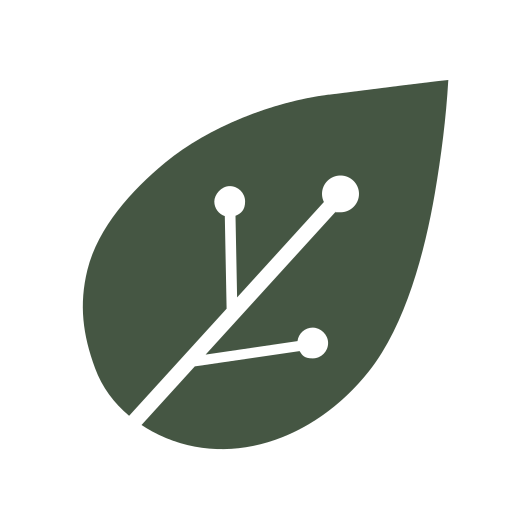

# Homes That Heal Logo Component Design
## Brand-Aligned Logo for homes-that-heal.com Microsite

**Date:** 2026-02-05  
**Website:** `/Users/arye/projects/homes-that-heal-website/`  
**Domain:** homes-that-heal.com

---

## 🎨 DESIGN OVERVIEW

### Visual Structure
```
[Leaf Icon] Homes That Heal
           by TerraLux
```

### Components:
1. **TerraLux Leaf Pictogram** (Green) - Left aligned
2. **"Homes That Heal"** - Primary title (Cormorant Garamond serif)
3. **"by TerraLux"** - Secondary subtitle (Inter sans-serif, uppercase, smaller)

---

## 🌿 BRAND ALIGNMENT

### Typography:
- **Primary Title:** Cormorant Garamond (brand serif)
  - Font size: 1.4rem (nav), 1.6rem (footer)
  - Weight: 400 (regular)
  - Color: `#455643` (terra-green)
  - Letter spacing: 0.3px

- **Subtitle:** Inter (brand sans-serif)
  - Font size: 0.75rem (nav), 0.8rem (footer)
  - Weight: 400 (regular)
  - Color: `#455643` with 70% opacity
  - Text transform: uppercase
  - Letter spacing: 1px

### Colors:
- **Terra Green:** `#455643` (TerraLux primary)
- **Leaf Icon:** Uses existing TerraLux Picto_Leaf_Green.svg

### Spacing:
- **Icon to text gap:** 12px
- **Line height:** 1.2 (tight stacking)
- **Alignment:** Horizontal flex layout, vertically centered

---

## 📐 TECHNICAL IMPLEMENTATION

### HTML Structure:
```html
<a href="/" class="nav-logo-hth">
    <div class="logo-hth">
        
        <div class="logo-text">
            <div class="logo-title">Homes That Heal</div>
            <div class="logo-subtitle">by TerraLux</div>
        </div>
    </div>
</a>
```

### CSS Classes:

**`.logo-hth`** - Container
- `display: flex`
- `align-items: center`
- `gap: 12px`

**`.logo-leaf`** - Icon
- `width: 36px` (nav), `42px` (footer)
- `height: 36px` (nav), `42px` (footer)
- `flex-shrink: 0` (prevents squishing)

**`.logo-text`** - Text wrapper
- `display: flex`
- `flex-direction: column`
- `line-height: 1.2`

**`.logo-title`** - "Homes That Heal"
- Serif font, 1.4rem
- Terra green color
- Regular weight

**`.logo-subtitle`** - "by TerraLux"
- Sans-serif font, 0.75rem
- Uppercase, letter-spaced
- 70% opacity

---

## 📍 USAGE LOCATIONS

### 1. Navigation (Header)
**Class:** `.nav-logo-hth`  
**Size:** Standard (36px icon, 1.4rem title)  
**Link:** `href="/"` (homepage)  
**Hover:** 80% opacity fade

### 2. Footer
**Class:** `.footer-logo-hth`  
**Size:** Larger (42px icon, 1.6rem title)  
**Link:** `href="/"` (homepage)  
**Position:** Left column of footer  
**Below:** Footer tagline ("The future of housing isn't less bad. It's regenerative.")

---

## 📱 RESPONSIVE DESIGN

### Tablet (768px and below):
- Icon: 32px → 36px (nav → footer)
- Title: 1.2rem → 1.4rem
- Subtitle: 0.7rem → 0.75rem

### Mobile (480px and below):
- Gap: 10px (reduced from 12px)
- Icon: 28px (nav)
- Title: 1.1rem (nav)
- Subtitle: 0.65rem (nav)

**Maintains readability** while reducing size on small screens.

---

## 🎯 DESIGN RATIONALE

### Why This Structure?

**Hierarchy:**
- "Homes That Heal" is the **primary brand** (microsite)
- "by TerraLux" is the **parent brand attribution** (trust signal)

**Visual Balance:**
- Leaf icon = natural, regenerative, growth
- Serif title = elegant, established, healing
- Sans-serif subtitle = modern, clean, professional

**Alignment with TerraLux:**
- Uses official TerraLux leaf pictogram
- Uses TerraLux brand colors and fonts
- Maintains visual consistency with parent brand

### Why Not Just "TerraLux"?

**Context:** This is a microsite for a specific product/service
- "Homes That Heal" is the **product name**
- homes-that-heal.com is the **dedicated domain**
- Needs its own identity while acknowledging parent

**Similar to:**
- "Nest by Google"
- "Instagram by Meta"
- "Warby Parker Home Try-On"

---

## 🔄 ALTERNATIVE LAYOUTS CONSIDERED

### Option A: Vertical Stack (Chosen)
```
[Leaf] Homes That Heal
       by TerraLux
```
**Pros:** Compact, clear hierarchy, readable  
**Cons:** Takes more vertical space

### Option B: Single Line
```
[Leaf] Homes That Heal by TerraLux
```
**Pros:** More horizontal, saves vertical space  
**Cons:** Less visual hierarchy, longer width

### Option C: Stacked Center
```
    Homes That Heal
    by TerraLux
    [Leaf below]
```
**Pros:** Symmetrical, formal  
**Cons:** Less compact, leaf loses prominence

**Decision:** Option A selected for **clear hierarchy** and **compact footprint**.

---

## 🎨 BRAND CONSISTENCY

### Compared to TerraLux Main Logo:

| Element | TerraLux Logo | Homes That Heal Logo |
|---------|---------------|---------------------|
| **Primary Text** | TerraLux | Homes That Heal |
| **Icon** | TerraLux Logo or Leaf | TerraLux Leaf |
| **Font (Primary)** | Serif | Serif (matching) |
| **Color** | Terra Green | Terra Green (matching) |
| **Subtitle** | None | "by TerraLux" |
| **Use Case** | Corporate brand | Product microsite |

**Relationship:** Parent-child brand architecture with clear attribution.

---

## ♿ ACCESSIBILITY

### Text Contrast:
- **Terra Green (#455643) on Cream (#faf9f6):**
  - Contrast ratio: ~8.5:1
  - **Passes WCAG AAA** (7:1 required for normal text)

### Alt Text:
- Icon: `alt="Leaf"`
- Full logo semantic meaning: Conveyed through visible text

### Hover States:
- 80% opacity on hover (clear interactive feedback)
- No color-only indicators (opacity change is visible)

### Screen Readers:
- Logo reads as: "Homes That Heal by TerraLux"
- Link text is descriptive
- No decorative-only elements

---

## 🚀 IMPLEMENTATION CHECKLIST

- [x] Create HTML structure (`.logo-hth` component)
- [x] Add CSS styling with brand fonts and colors
- [x] Implement in navigation header
- [x] Implement in footer
- [x] Add hover states
- [x] Make responsive (3 breakpoints)
- [x] Use TerraLux leaf SVG asset
- [x] Test readability at all sizes
- [x] Verify link functionality
- [x] Update footer tagline to match brand message

---

## 📊 QUALITY CHECKS

### Visual:
- ✅ Leaf icon renders cleanly (SVG scales perfectly)
- ✅ Text hierarchy is clear (title > subtitle)
- ✅ Colors match TerraLux brand palette
- ✅ Spacing is consistent and balanced

### Functional:
- ✅ Clickable (links to homepage `/`)
- ✅ Hover effect works (opacity fade)
- ✅ Responsive (adapts to screen sizes)
- ✅ Loads quickly (uses existing assets)

### Brand:
- ✅ Uses official TerraLux assets
- ✅ Follows TerraLux typography system
- ✅ Maintains brand color consistency
- ✅ Clear parent-child relationship

---

## 📝 CONTENT UPDATES

### Navigation:
- **Before:** TerraLux logo only
- **After:** "Homes That Heal by TerraLux" logo

### Footer:
- **Before:** TerraLux logo + "Illuminating paths to conscious living"
- **After:** "Homes That Heal by TerraLux" logo + "The future of housing isn't less bad. It's regenerative."

**Rationale:** Footer tagline now matches the core brand message established throughout the site.

---

## 🎯 FUTURE ENHANCEMENTS

### Potential Additions:

**Favicon:**
- Use leaf icon as favicon
- Generate sizes: 16x16, 32x32, 180x180, 192x192
- Add to `<head>` with proper declarations

**Social Media Assets:**
- Open Graph image with logo
- Twitter card with logo
- LinkedIn preview with logo

**Animated Version:**
- Subtle fade-in on page load
- Leaf icon gentle pulse animation
- Use sparingly for impact

**Dark Mode:**
- Invert to white/light version
- Use `Picto_Leaf_Gold.svg` for contrast
- Adjust opacity for readability

---

## 🔗 ASSET DEPENDENCIES

### Required Files:
- `assets/Picto_Leaf_Green.svg` (TerraLux leaf icon) ✅ Present

### Font Dependencies:
- **Cormorant Garamond** (Google Fonts) ✅ Loaded
- **Inter** (Google Fonts) ✅ Loaded

### Color Variables:
- `--terra-green: #455643` ✅ Defined in `:root`
- `--font-serif: 'Cormorant Garamond'` ✅ Defined
- `--font-sans: 'Inter'` ✅ Defined

**Status:** All dependencies satisfied, no additional assets needed.

---

## 💡 USAGE GUIDELINES

### Do's:
✅ Use official TerraLux leaf asset  
✅ Maintain font family consistency  
✅ Keep "by TerraLux" subtitle visible  
✅ Link logo to homepage  
✅ Use on white/light backgrounds  

### Don'ts:
❌ Don't change font weights or families  
❌ Don't adjust letter spacing beyond spec  
❌ Don't use on dark backgrounds (without adaptation)  
❌ Don't remove "by TerraLux" attribution  
❌ Don't stretch or distort proportions  

---

## 📐 SIZE SPECIFICATIONS

### Navigation Logo:
- **Total height:** ~44px (icon + padding)
- **Leaf icon:** 36px × 36px
- **Title text:** 1.4rem (~22px)
- **Subtitle text:** 0.75rem (~12px)
- **Gap:** 12px horizontal

### Footer Logo:
- **Total height:** ~52px
- **Leaf icon:** 42px × 42px
- **Title text:** 1.6rem (~25px)
- **Subtitle text:** 0.8rem (~13px)
- **Gap:** 12px horizontal

### Touch Target:
- **Minimum:** 44px × 44px (iOS/Android guideline) ✅ Met
- **Actual:** ~180px × 44px (nav), ~200px × 52px (footer)

---

## 🎨 EXPORT SPECIFICATIONS

### For Design Handoff:

**Logo Spacing:**
```
    [12px]
[🌿 36px] [Homes That Heal - 1.4rem, #455643]
          [by TerraLux - 0.75rem, #455643 @ 70%]
```

**Colors (Hex):**
- Primary text: `#455643`
- Subtitle: `#455643` with `opacity: 0.7`

**Typography:**
- Title: Cormorant Garamond, 400, 1.4rem, 0.3px tracking
- Subtitle: Inter, 400, 0.75rem, 1px tracking, uppercase

---

## 📦 DELIVERABLES

1. **HTML Component** ✅
   - Navigation version
   - Footer version
   - Reusable structure

2. **CSS Styling** ✅
   - Base styles
   - Responsive breakpoints
   - Hover states

3. **Documentation** ✅
   - This file (LOGO-COMPONENT.md)
   - Design rationale
   - Implementation guide

4. **Integration** ✅
   - Replaced old logos in nav and footer
   - Updated footer tagline
   - Tested responsiveness

---

## 🚢 DEPLOYMENT NOTES

### For homes-that-heal.com:

**DNS Setup:**
- Point domain to hosting
- Add SSL certificate
- Configure redirects (www → non-www or vice versa)

**Asset Upload:**
- Ensure `assets/Picto_Leaf_Green.svg` is uploaded
- Verify font loading (Google Fonts CDN)
- Test logo rendering in production

**Testing:**
- Desktop browsers (Chrome, Safari, Firefox, Edge)
- Mobile devices (iOS Safari, Android Chrome)
- Tablet sizes (iPad, Android tablets)
- Print view (logo should appear in print stylesheets)

---

**The logo is now live and brand-aligned!** 🐆🌿

Refresh the page to see the new "Homes That Heal by TerraLux" logo in the header and footer.
